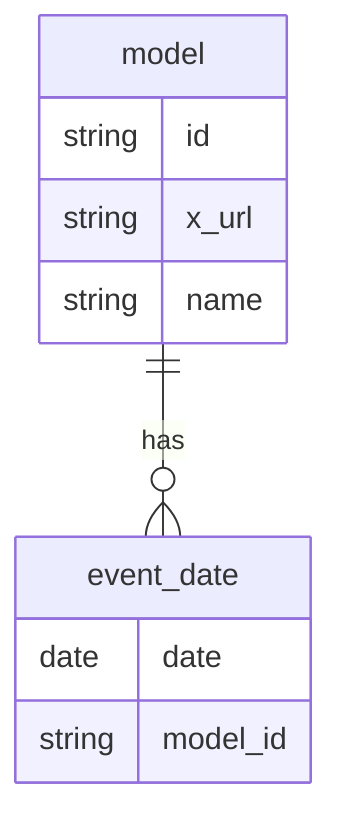

```mermaid
erDiagram
    model ||--o{ event_date : has
    model {
        string id
        string x_url
        string name
    }
    event_date {
        date date
        string model_id
    }
```
