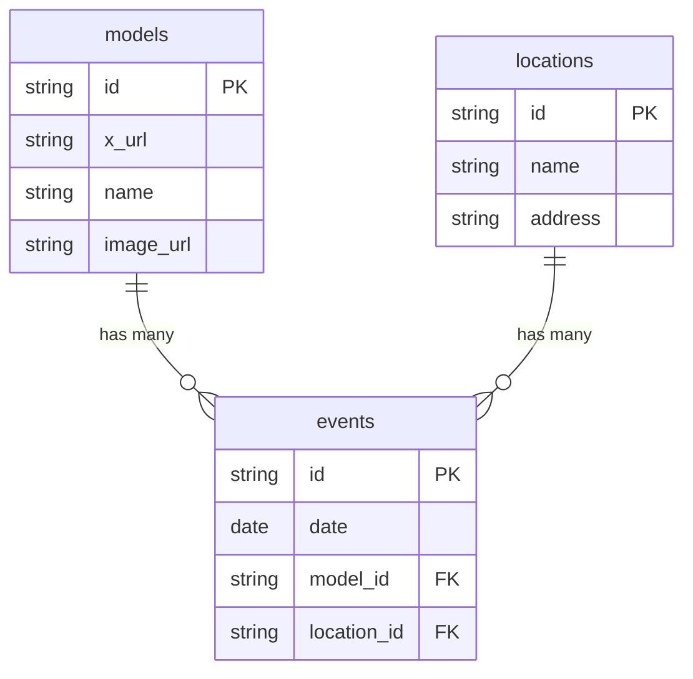

```mermaid
erDiagram
    models ||--o{ events : "has many"

    models {
        string id PK
        string x_url
        string name
        string image_url
    }

    events {
        string id PK
        date date
        string model_id FK
        string location_id FK
    }

    locations ||--o{ events : "has many"

    locations {
        string id PK
        string name
        string address
    }
```
